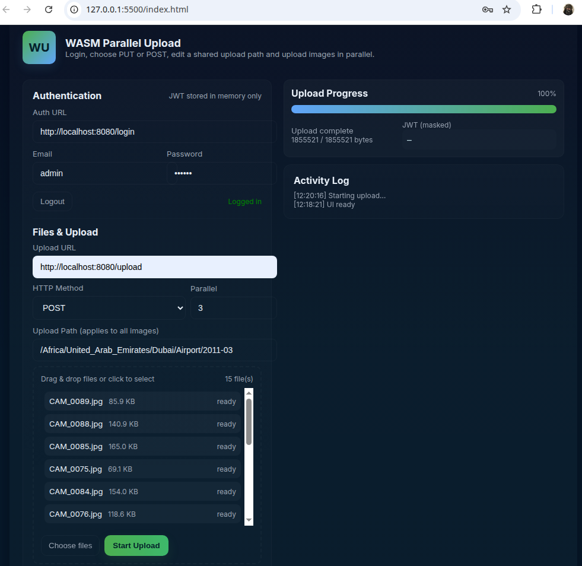

# WASM parallel uploader

[](https://opensource.org/licenses/MIT)
[]()

[](https://github.com/Zheng-Bote/wasm_uploader/releases)

[Report Issue](https://github.com/Zheng-Bote/wasm_uploader/issues) · [Request Feature](https://github.com/Zheng-Bote/wasm_uploader/pulls)

<!-- START doctoc generated TOC please keep comment here to allow auto update -->
<!-- DON'T EDIT THIS SECTION, INSTEAD RE-RUN doctoc TO UPDATE -->
**Table of Contents**

- [Project Overview](#project-overview)
  - [Features](#features)
- [Screenshots](#screenshots)
- [Files](#files)
- [Prerequisites](#prerequisites)
- [Build Instructions](#build-instructions)
- [Usage](#usage)
- [Troubleshooting](#troubleshooting)
- [Notes and Next Steps](#notes-and-next-steps)
- [📝 License](#-license)
- [Author](#author)
  - [Code Contributors](#code-contributors)

<!-- END doctoc generated TOC please keep comment here to allow auto update -->

---

## Project Overview

A small demo showing a Web Worker that coordinates parallel chunked uploads controlled by a WebAssembly engine. The UI supports user login (username/password → JWT), choosing PUT or POST, and a single editable upload path applied to all images. The WebAssembly module implements the upload plan and progress logic; the Worker performs chunk uploads and forwards results to the WASM engine.

### Features

the app already covers login, chunking, parallel uploads, PUT/POST modes, and a polished UI.

## Screenshots



## Files

**upload_engine.cpp** — C++ upload engine exposing a single C ABI function wasm_handle_message(inPtr,inLen,outPtr,outCap) -> outLen. Uses nlohmann::json for message parsing and response generation.
**upload_engine.mjs** and **upload_engine.wasm** — generated Emscripten outputs (JS wrapper + WASM).
**upload_worker.js** — Web Worker that loads the Emscripten module, marshals JSON messages into the WASM heap, performs chunk uploads (PUT or POST multipart/form-data with fields photo and path), and posts progress messages back to the main thread.
**main.js** — Browser client: login flow, file selection, path suggestion and editing, job creation, and worker messaging.
**index.html** — Minimal UI for login, file selection, path editing, method selection, and progress display.
**README.md** — This file.

## Prerequisites

**Emscripten SDK** installed and activated.

**nlohmann/json** header (json.hpp) placed next to upload_engine.cpp.

A backend **login endpoint** that accepts POST JSON { "username": "...", "password": "..." } and returns JSON { "token": "<JWT>", "expires_in": 3600 } (expires_in optional).

A backend **upload endpoint** that accepts either:

**PUT**: raw chunk body (optionally Content-Type: application/octet-stream or file MIME type), or

**POST**: multipart/form-data with fields photo (file blob) and path (string).

## Build Instructions

Run the following command from the project folder (adjust emcc path if needed):

```bash
emcc upload_engine.cpp -std=c++20 -O3 \
 -s EXPORTED_FUNCTIONS='["_malloc","_free","_wasm_handle_message"]' \
 -s EXPORTED_RUNTIME_METHODS='["cwrap","getValue","setValue"]' \
 -s ALLOW_MEMORY_GROWTH=1 \
 -s INITIAL_MEMORY=128MB \
 -s MODULARIZE=1 \
 -s EXPORT_ES6=1 \
 -s ENVIRONMENT="web,worker" \
 -o upload_engine.mjs
```

**Result**

**upload_engine.mjs** and **upload_engine.wasm** will be produced. Place them next to **upload_worker.js** and serve the folder over HTTP(S).

## Usage

1. Serve the project folder with a static server (e.g., python -m http.server 8000) and open index.html in a modern browser.
2. Enter your Auth URL, email, and password, then click Login. On success the UI enables the upload button.
3. Select files (optionally a directory using the browser directory picker). The UI will suggest an Upload Path derived from the first file; edit it if needed.
4. Choose PUT or POST. For POST the Worker sends photo and path in multipart/form-data. For PUT the Worker sends the chunk as the raw request body.
5. Click Upload. The Worker and WASM engine coordinate chunk requests and progress updates. The UI shows progress and final completion.

## Troubleshooting

**Module.\_malloc is not a function**

Rebuild with \_malloc and \_free exported as shown in the Build Instructions.

**JSON parse errors or garbled responses**

- Rebuild upload_engine.cpp with the provided safe write logic so the WASM engine returns the exact number of bytes written.
- Ensure the Emscripten build produces upload_engine.mjs and upload_engine.wasm and that the browser loads the newest files (clear cache / hard reload).

**Import errors like Import #0 "a"**

Do not build with STANDALONE_WASM=1, SIDE_MODULE, or WASM64. Use the Emscripten command above so the JS wrapper provides the runtime imports.

**POST multipart/form-data specifics**

If your backend expects additional fields or a different field name for the file or path, update upload_worker.js to match the API (field names and any extra metadata).

**Large responses truncated**

The Worker implements a dynamic out buffer strategy. If you still see truncated responses, increase outCap in callWasmJsonSync or inspect the raw response returned by the WASM engine for debugging.

## Notes and Next Steps

- The JWT is stored only in memory and forwarded as Authorization: Bearer <token> for upload requests. For refresh tokens or long sessions implement a secure refresh flow on the server side.
- If you need per-file paths instead of a single global path, extend the UI to collect per-file metadata and include path per job.files[i].
- For resumable uploads with Content-Range or server-side session tokens, adapt uploadChunk to set the required headers and retry logic.

---

## 📝 License

This project is licensed under the MIT License - see the LICENSE file for details.

Copyright (c) 2026 ZHENG Robert.

## Author

[](https://www.github.com/Zheng-Bote)

### Code Contributors


---

**Happy coding! 🚀** :vulcan_salute:
